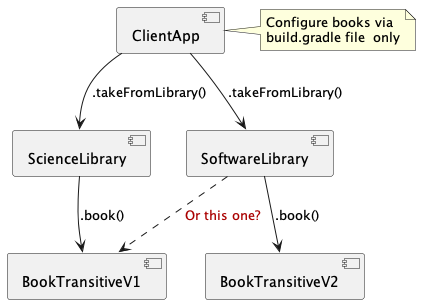

# GradleDependencies

This module is focused on Gradle dependencies management, which is an essential part of software development. In Gradle,
dependencies refer to external libraries and frameworks that a project requires to function correctly.

Managing dependencies can be a complicated task as it involves ensuring that all dependencies are compatible with each
other and with the project's codebase. Gradle provides a robust and flexible system for managing dependencies that makes
it easier to manage complex projects.

In this module, you will learn how to declare dependencies in your Gradle project, manage different versions of the same
dependency, exclude transitive dependencies, and manage dependencies for different build variants. You will also learn
how to use Gradle's dependency cache and how to publish your own dependencies to a remote repository.

By the end of this module, you should have a solid understanding of how to manage dependencies in a Gradle project and
be able to apply this knowledge to your own projects effectively.

[Install & configure](#Installation) projects modules & solve [tasks](#tasks).

Please read before:

* Gradle docs
    * [Working with Dependencies: Learning the basics](https://docs.gradle.org/current/userguide/core_dependency_management.html)
    * [ Working with Dependencies: Controlling Transitives](https://docs.gradle.org/current/userguide/dependency_constraints.html)
* [Manage Gradle version conflicts with resolution strategy](https://proandroiddev.com/manage-gradle-version-conflicts-with-strategy-611ac3f6ce19)

### Description of project modules

The project consist all required modules for the task. You need to compile them and publish to Your local repository (_
publishToMavenLocal_ command).



The project has a runnable module [ _ClientApp_](../main/ClientApp).<br/>
Which has 2 dependencies on: [_ScienceLibrary_](../main/ScienceLibrary) and [_SoftwareLibrary_](../main/SoftwareLibrary)
.<br/>
Both libraries have dependencies on the _Book_ module, but on different versions.<br/>
_ScienceLibrary_ depends on [_booktransitive:0.1_](../main/BookTransitiveV1), _SoftwareLibrary_ on - [_booktransitive:
0.2_](../main/BookTransitiveV2).<br>

Resolve dependencies by changing the [../ClientApp/build.gradle](../main/ClientApp/build.gradle) file. Use
Gradle [dependency management](https://docs.gradle.org/current/userguide/core_dependency_management.html) for it.

## Tasks

### Task 1 - preparation

* [Install & configure](#Installation) projects
* Run the command bellow, check results:

```sh
% gradle clean build run

> Task :run

 ...
    |  /                                           /.
    \_/___________________________________________/.

Action 1: I take from the 'Science Library'   a book 'Programming in Scala Fifth Edition 5st edition.' by Martin Odersky (v2)
Action 2: I take from the 'Software Library'  a book 'Programming in Scala Fifth Edition 5st edition.' by Martin Odersky (v2)

The application is over...

```

* Print dependencies tree, and explain it.

### Task 2 - dependency management

Change resolved _Book_ dependencies for this task. The result should be:

```sh
% gradle clean build run

> Task :run

 ...
    |  /                                           /.
    \_/___________________________________________/.

Action 1: I take from the 'Science Library'   a book 'Machine Learning Yearning'. by Andrew Ng. (v1)
Action 2: I take from the 'Software Library'  a book 'Machine Learning Yearning'. by Andrew Ng. (v1)


The application is over...

```

Do it by changing the [build.gradle](../main/ClientApp/build.gradle) file. Provide several way to do that:

* Declaring simple version declaration
* Declaring rich versions
* Exclude unnecessary dependency
* Use resolution strategy

Explain what each method does. Show pros/contra of each of them.

### Task 3 - optional

* Add code for failing on versions conflict.
* Add code for failing on specific _Book_ version.
* Implement _Book_ resolving in the case of the presence of an environment variable. Do it in
  the [build.gradle](../main/ClientApp/build.gradle)
* Add slf4-logging to all sub-modules. Describe what dependencies in what module should be used.
* Find/use Gradle plugins for dependencies management (
  e.g. [here](https://plugins.gradle.org/search?term=dependencies+conflicts))

## Installation

You should have:
* JVM version >= 9
* Scala version >= 13 
* Gradle version >= 7
(The other version maybe working as well)

Download the project and perform 5 steps described bellow.

Step 1: Transitive library v1</br>
Inside the _$ROOT_PROJECT_ folder

```sh
cd BookTransitiveV1
gradle clean build publishToMavenLocal
```

Verification for the _$HOME_ folder

```sh
% ls -l ~/.m2/repository/com/tfedorov/gradledependencies/booktransitive/0.1
total 24
-rw-r--r--  1 tfedorov  staff  2064 Aug  9 21:51 booktransitive-0.1.jar
-rw-r--r--  1 tfedorov  staff  1915 Aug  9 21:51 booktransitive-0.1.module
-rw-r--r--  1 tfedorov  staff   774 Aug  9 21:51 booktransitive-0.1.pom
```

Step 2: Transitive library v2</br>
Inside the _$ROOT_PROJECT_ folder

```sh
cd BookTransitiveV2
gradle clean build publishToMavenLocal
```

Verification for the _$HOME_ folder

```sh
% ls -l ~/.m2/repository/com/tfedorov/gradledependencies/booktransitive/0.2
total 24
-rw-r--r--  1 tfedorov  staff  2088 Aug  9 21:51 booktransitive-0.2.jar
-rw-r--r--  1 tfedorov  staff  1915 Aug  9 21:51 booktransitive-0.2.module
-rw-r--r--  1 tfedorov  staff   774 Aug  9 21:51 booktransitive-0.2.pom
```

Step 3: Library 1</br>
Inside the _$ROOT_PROJECT_ folder

```sh
cd ScienceLibrary
gradle clean build publishToMavenLocal
```

Verification for the _$HOME_ folder

```sh
% ls -l ~/.m2/repository/com/tfedorov/gradledependencies/sciencelibrary/0.1
total 24
-rw-r--r--  1 tfedorov  staff  2276 Aug  9 21:54 sciencelibrary-0.1.jar
-rw-r--r--  1 tfedorov  staff  2125 Aug  9 21:54 sciencelibrary-0.1.module
-rw-r--r--  1 tfedorov  staff  1005 Aug  9 21:54 sciencelibrary-0.1.pom
```

Step 4: Library 2</br>
Inside the _$ROOT_PROJECT_ folder

```sh
cd SoftwareLibrar
gradle clean build publishToMavenLocal
```

Verification for the _$HOME_ folder

```sh
 % ls -l ~/.m2/repository/com/tfedorov/gradledependencies/softwarelibrary/0.1
total 24
-rw-r--r--  1 tfedorov  staff  2290 Aug  9 21:55 softwarelibrary-0.1.jar
-rw-r--r--  1 tfedorov  staff  2130 Aug  9 21:55 softwarelibrary-0.1.module
-rw-r--r--  1 tfedorov  staff  1006 Aug  9 21:55 softwarelibrary-0.1.pom
```

Step 4: Client App</br>
Inside the _$ROOT_PROJECT_ folder

```sh
cd ClientApp
gradle clean build run

> Task :run

    ____________________________________________
 / \                                            \.
|   |                                           |.
 \_ |                                           |.
    |   This is a tutorial application for the  |.
    | Gradle Dependencies managment.            |.
    |                                           |.
    | The App performs 2 actions:               |.
    |  - take a 'Book' in a 'Science Library'   |.
    |  - take a 'Book' in a 'Software Library'  |.
    |                                           |.
    |  'Science Library' and 'Software Library' |.
    | are 2 modules each of them contains       |.
    | a 'Book' module as a dependency           |.
    |                                           |.
    |  There are several versions of a 'Book':  |.
    |   - booktransitive:0.1                    |.
    |   - booktransitive:0.2                    |.
    |                                           |.
    |  The Gradle defines version of the 'Book' |.
    | by DEPENDECY MANAGEMENT.                  |.
    |                                           |.
    |   ________________________________________|___
    |  /                                           /.
    \_/___________________________________________/.

Action 1: I take from the 'Science Library'   a book 'Programming in Scala Fifth Edition 5st edition.' by Martin Odersky (v2)
Action 2: I take from the 'Software Library'  a book 'Programming in Scala Fifth Edition 5st edition.' by Martin Odersky (v2)

The application is over...
```
